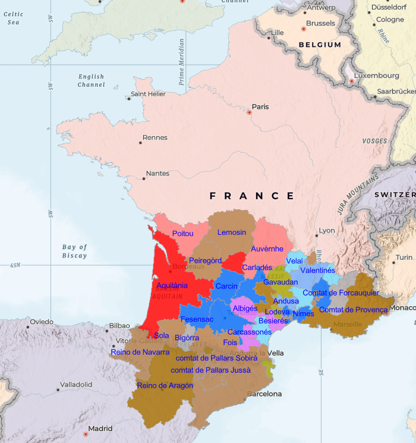
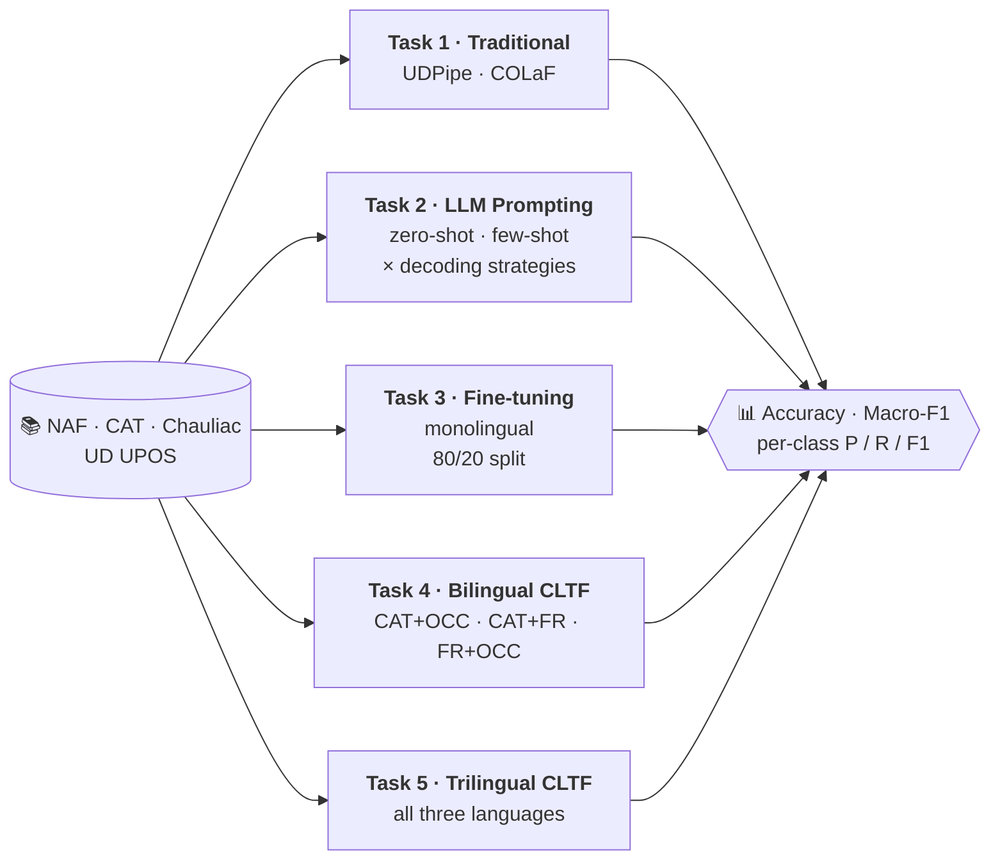
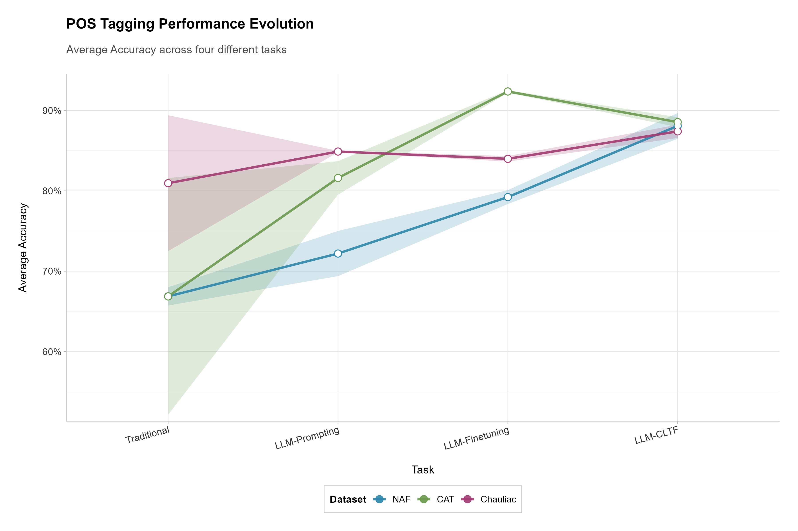
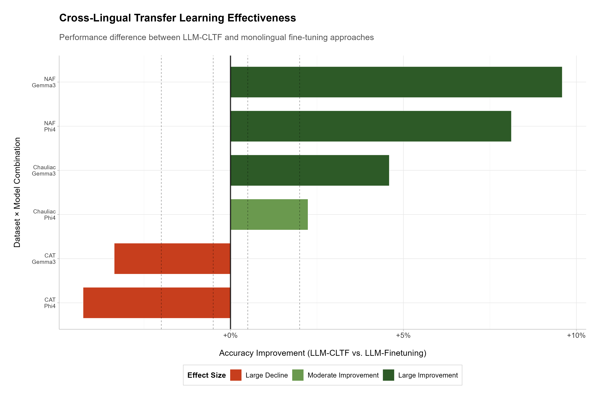
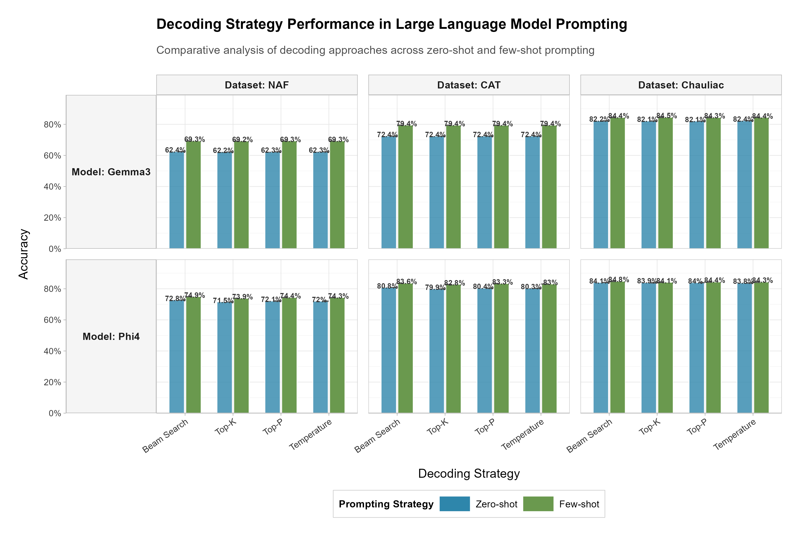
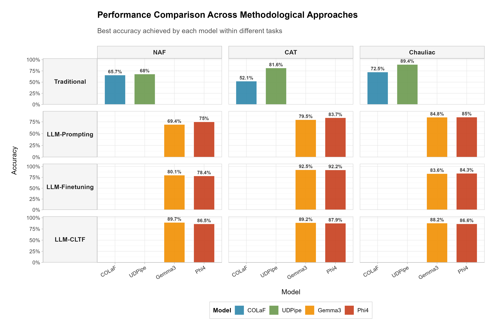
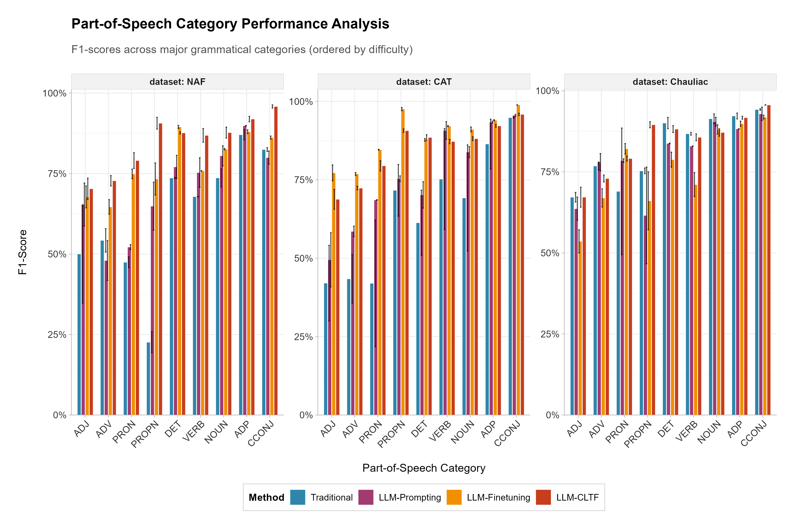

<div align="center">

# 📜 From Traditional Taggers to LLMs

### A Comparative Study of POS Tagging for Medieval Romance Languages

**Matthias Schöffel**¹ · **Esteban Garces Arias**²˒³

¹ Bavarian Academy of Sciences (BAdW), Munich · ² Department of Statistics, LMU Munich · ³ Munich Center for Machine Learning (MCML)

*Proceedings of the 6th International Conference on Natural Language Processing for the Digital Humanities (NLP4DH 2026)*

[](https://aclanthology.org/2026.nlp4dh-1.27/)
[](https://aclanthology.org/2026.nlp4dh-1.27.pdf)
[](LICENSE)


</div>

---

## 🔎 Overview

Part-of-speech (POS) tagging of **medieval Romance languages** is hard: spelling is unstable, dialects vary, morphology is rich, and annotated data is scarce. Tools built for modern standard languages often struggle with this material.

This repository holds the **data, code, model outputs and evaluation reports** for our systematic comparison of **traditional taggers** (UDPipe, COLaF) and **open-source LLMs** (Gemma3‑12B, Phi4‑14B) on three medieval varieties:

<table align="center">
<tr>
<td align="center">🟦 <b>Medieval Occitan</b><br><sub>14th c.</sub></td>
<td align="center">🟩 <b>Medieval Catalan</b><br><sub>13th c.</sub></td>
<td align="center">🟪 <b>Medieval French</b><br><sub>15th c.</sub></td>
</tr>
</table>

> [!TIP]
> **TL;DR**: LLMs beat traditional taggers in every setting we tested. Fine-tuning and multilingual training bring the largest gains. Cross-lingual transfer helps most for under-resourced varieties (**+21.7 pp** on Medieval Occitan over UDPipe), and a targeted **bilingual** pairing can outperform broader trilingual training.

### Research questions

1. **How do LLM-based approaches compare** with established POS taggers for medieval Romance varieties?
2. **How much do prompting strategies and decoding settings** affect tagging performance?
3. **Can cross-lingual transfer learning** improve performance across related historical languages?

---

## 🗺️ Languages & Datasets

<table>
<tr>
<td width="48%">



<sub>Regional variation of Medieval Occitan and Medieval Catalan, 13th century (after Cabré, 2014).</sub>

</td>
<td width="52%">

| Dataset | Language | Source | Genre | Tokens |
|:--|:--|:--|:--|--:|
| **NAF** | Med. Occitan (14th c.) | *Vida de Sant Honorat* (BnF NAF 6195) | Literary | 45,457 |
| **CAT** | Med. Catalan (13th c.) | *Llibre dels Fets* | Chronicle | 59,359 |
| **Chauliac** | Med. French (15th c.) | *Anathomie*, Gui de Chauliac's *Grande Chirurgie* | Medical | 2,443 |

**Why is this hard? Spelling variation:**

| Medieval form | Modern form |
|:--|:--|
| *deffendre* (FR) | défendre, "to defend" |
| *ssaber* (CAT) | saber, "to know" |
| *Ffrança* (CAT) | França, "France" |
| *liech / lech* (OCC) | lloc, "place" |
| *fuoc / foc* (OCC) | foc, "fire" |

</td>
</tr>
</table>

All datasets were tokenized, sentence-segmented, manually checked, and harmonized to the **Universal Dependencies UPOS** tagset. Sources and licences for the texts are listed in [`data/README.md`](data/README.md).

---

## 🧪 Experimental Setup



| | Details |
|:--|:--|
| **Models** | UDPipe, COLaF (traditional) · Gemma3‑12B, Phi4‑14B (LLMs, LoRA fine-tuning) |
| **Prompting** | Zero-shot (UPOS tag list + JSON output format) and few-shot (adds mixed-language annotated examples) |
| **Decoding** | Beam search (*w* ∈ {1, 15}), temperature (τ ∈ {0.6, 0.8, 0.9}), top-*k* (*k* ∈ {5, 20, 50}), top-*p* (*p* ∈ {0.75, 0.85, 0.95}) |
| **Fine-tuning** | A fixed 80/20 train/test split per dataset, reused in every setting, so test tokens are never seen during training |
| **CLTF** | Cross-lingual transfer: train on the union of 2 or 3 training partitions, then evaluate on each language's held-out 20% |
| **Hardware** | NVIDIA H100 (96 GB) |

---

## 📈 Key Results

<div align="center">

</div>

**Average accuracy by method family:**

```text
Traditional taggers   ██████████████████████████████████▉            71.56 %
LLM prompting         ██████████████████████████████████████▊        77.75 %
LLM fine-tuning       ██████████████████████████████████████████▌    85.19 %
Trilingual CLTF       ████████████████████████████████████████████   88.01 %
```

### Best accuracy per dataset

| Method | NAF 🟦 Occitan | CAT 🟩 Catalan | Chauliac 🟪 French |
|:--|:--:|:--:|:--:|
| UDPipe | 68.01 | 81.59 | 89.40 |
| COLaF | 65.73 | 52.15 | 72.50 |
| Best prompting (Phi4 few-shot) | 75.01 | 83.69 | 84.98 |
| Fine-tuning (Gemma3) | 80.09 | **🥇 92.52** | 83.64 |
| Bilingual CLTF (Gemma3) | 89.25 <sub>CAT+OCC</sub> | 91.62 <sub>CAT+OCC</sub> | **🥇 93.14** <sub>CAT+FR</sub> |
| Trilingual CLTF (Gemma3) | **🥇 89.68** | 89.16 | 88.23 |
| **Δ best CLTF vs. UDPipe** | **+21.67** | **+7.57** | **+3.74** |

<sub>Accuracy in %. Macro-F1 and Phi4 results are in Table 4 of the paper.</sub>

### 💡 Takeaways

- **LLMs outperform traditional taggers** on every dataset. UDPipe drops to 68% on Medieval Occitan, which has the most orthographic variation.
- **Few-shot beats zero-shot** in every model/dataset pair (+2.9 to +10.2 pp). **Deterministic decoding** works best, and beam search (*w* = 15) is consistently the top strategy.
- **Catalan works as a bridge language.** Pairing it with Occitan or French gives large gains, which fits its intermediate position between Gallo-Romance and Occitano-Romance.
- **More languages is not always better.** For the small French dataset, bilingual CAT+FR (93.14%) clearly beats trilingual training (88.23%).
- **Content words benefit most.** Proper nouns, numerals, pronouns and subordinating conjunctions improve by up to **+66 F1 points** over UDPipe on NAF.

<details>
<summary><b>🖼️ More figures</b> (click to expand)</summary>
<br>

| Effect of trilingual CLTF vs. monolingual fine-tuning | Decoding strategies |
|:--:|:--:|
|  |  |
| **Overall performance** | **Per-POS-class performance** |
|  |  |

High-resolution PDF versions of all figures are in [`data_analysis/`](data_analysis/).

</details>

---

## 📂 Repository Structure

```text
medieval-romance-pos/
├── data/                     # Gold-standard reference data (xlsx/txt) + data sources
│   ├── NAF_reference.xlsx          Medieval Occitan
│   ├── Llibre_reference.xlsx       Medieval Catalan
│   ├── Chauliac_reference.xlsx     Medieval French
│   └── cat-naf-chauliac.xlsx …     Combined sets for cross-lingual transfer
│
├── udpipe/                   # Task 1 – UDPipe baseline: conversion scripts + reports
├── colaf/                    # Task 1 – COLaF baseline: conversion scripts + reports
│
├── gemma3/                   # Task 2 – Prompting with Gemma3-12B
│   └── {zero,few}-{naf,cat,chauliac}/<run>/   classification report + confusion matrix
├── phi4/                     # Task 2 – Prompting with Phi4-14B (+ prompting scripts)
├── model output-prompts/     # Task 2 – Raw JSON output of every prompting run
│
├── fine-tuning/              # Task 3 – Monolingual fine-tuning (scripts, logs, reports)
├── fine-tuning-CLTL/         # Tasks 4–5 – Bilingual & trilingual cross-lingual transfer
│
└── data_analysis/            # R/Python analysis scripts, aggregated reports, figures
```

<details>
<summary><b>🏷️ Run naming convention</b> (e.g. <code>tagging_b15_naf_few_gemma3_5</code>)</summary>
<br>

| Part | Meaning |
|:--|:--|
| `b1`, `b15`, `b50` | Beam search with beam width 1 / 15 / 50 |
| `k5`, `k20`, `k50` | Top-*k* sampling |
| `p75`, `p85`, `p95` | Nucleus (top-*p*) sampling with *p* = 0.75 / 0.85 / 0.95 |
| `t6`, `t8`, `t9` | Temperature sampling with τ = 0.6 / 0.8 / 0.9 |
| `naf` / `cat` / `chauliac` | Dataset |
| `zero` / `few` | Prompting strategy |
| `gemma3` / `phi4` | Model |

Fine-tuning runs use the suffixes `_f_g3` (Gemma3) and `_f_phi4` (Phi4). CLTF folder names such as `chauliac-cat-naf` list the languages included in training.

</details>

---

## ⚙️ Reproducing the Experiments

The scripts are the **base code** for every experiment. Each one is written for a specific dataset/model configuration, so **dataset names, model identifiers and file paths may need adjusting** for your environment.

1. **Get the data.** Reference files are in [`data/`](data/). The original corpora are on Zenodo (see [`data/README.md`](data/README.md)).
2. **Traditional baselines.** Use the conversion helpers in [`udpipe/`](udpipe/) and [`colaf/`](colaf/) (`text2xlsx.py`, `conllu2xlsx.py`, `txtcolaf2xlsx.py`, …) to align tagger output with the gold standard.
3. **Prompting.** Run the scripts in [`phi4/`](phi4/), then convert and evaluate the JSON output with [`gemma3/json2xlsx.py`](gemma3/json2xlsx.py) and [`gemma3/analysis.py`](gemma3/analysis.py).
4. **Fine-tuning / CLTF.** Use the scripts in [`fine-tuning/`](fine-tuning/) and [`fine-tuning-CLTL/`](fine-tuning-CLTL/). A GPU with enough memory for 12–14B models with LoRA is required.
5. **Analysis & figures.** Use [`data_analysis/classification_report_extraction.py`](data_analysis/classification_report_extraction.py), [`performance_analysis.R`](data_analysis/performance_analysis.R) and [`prompting_analysis.R`](data_analysis/prompting_analysis.R).

---

## 📚 Data Sources

| Corpus | Reference |
|:--|:--|
| **COMETA**: Corpus de l'occitan médiéval comparatif et annoté (NAF 6195) | Wiedner (ed.), 2025 · [Zenodo 15300719](https://zenodo.org/records/15300719) |
| **HisCat**: Annotated Corpora of Historical Catalan, *Llibre dels Fets* | Pujol i Campeny & Meelen, 2021 · [doi:10.5281/zenodo.5615759](https://doi.org/10.5281/zenodo.5615759) |
| **Gui de Chauliac**, *Anathomie* (*Grande Chirurgie*) | Tittel, 2004. Partially annotated subset provided by the ALMA project |

---

## 📝 Citation

If you use this code or data, please cite:

```bibtex
@inproceedings{schoeffel-garces-arias-2026-traditional,
    title     = {From Traditional Taggers to {LLM}s: A Comparative Study of {POS} Tagging for Medieval {R}omance Languages},
    author    = {Sch{\"o}ffel, Matthias and Garces Arias, Esteban},
    booktitle = {Proceedings of the 6th International Conference on Natural Language Processing for the Digital Humanities},
    month     = jul,
    year      = {2026},
    publisher = {Association for Computational Linguistics},
    url       = {https://aclanthology.org/2026.nlp4dh-1.27/},
    pages     = {297--313}
}
```

<details>
<summary><b>Related work by the authors</b></summary>
<br>

- Schöffel, Wiedner, Garces Arias, Ruppert, Heumann & Aßenmacher (2025). *Modern Models, Medieval Texts: A POS Tagging Study of Old Occitan.* [arXiv:2503.07827](https://arxiv.org/abs/2503.07827)
- Schöffel, Garces Arias, Wiedner, Ruppert, Li, Heumann & Aßenmacher (2025). *Unveiling Factors for Enhanced POS Tagging: A Study of Low-Resource Medieval Romance Languages.*

</details>

---

## 🙏 Acknowledgments

We thank the **ALMA** project (*Wissensnetze in der mittelalterlichen Romania*) for access to the Chauliac data, **Marinus Wiedner** for annotating and publishing the Medieval Occitan corpora, and the **Leibniz-Rechenzentrum (LRZ)** for computational resources. Esteban Garces Arias thanks the Mentoring Program of the Faculty of Mathematics, Statistics, and Informatics at LMU Munich and the **Munich Center for Machine Learning (MCML)** for their support.

<div align="center">

<sub>Released under the <a href="LICENSE">MIT License</a> · The underlying corpora keep their original licences</sub>

</div>
